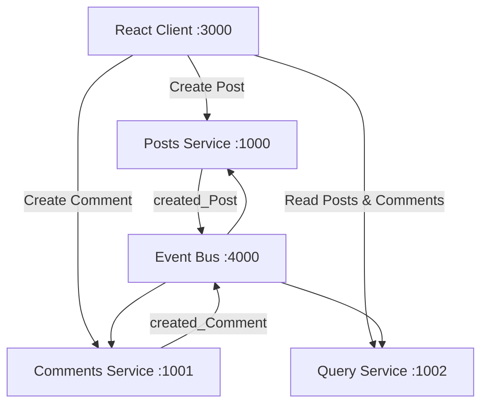

# Mini Microservices Application

A full-stack **Event-Driven Microservices Application** built with **Node.js, Express.js, and React**.

This project demonstrates **Microservices Architecture, Event-Driven Communication, CQRS, and Database-per-Service** using an HTTP-based Event Bus.

---

## Architecture



### Architecture Flow

```text
                    ┌──────────────────┐
                    │   React Client   │
                    │      :3000       │
                    └────────┬─────────┘
                             │
              ┌──────────────┼──────────────┐
              │              │              │
              ▼              ▼              ▼
        ┌──────────┐   ┌──────────┐   ┌──────────┐
        │  Posts   │   │ Comments │   │  Query   │
        │  :1000   │   │  :1001   │   │  :1002   │
        └────┬─────┘   └────┬─────┘   └────▲─────┘
             │              │              │
             │    Events    │              │
             └───────┬──────┘              │
                     ▼                     │
              ┌──────────────┐             │
              │   Event Bus  │─────────────┘
              │    :4000     │
              └──────────────┘
```

---

## Microservices

| Service              |   Port | Responsibility                      |
| -------------------- | -----: | ----------------------------------- |
| **Posts Service**    | `1000` | Creates and manages posts           |
| **Comments Service** | `1001` | Creates and manages comments        |
| **Query Service**    | `1002` | Maintains the aggregated read model |
| **Event Bus**        | `4000` | Receives and broadcasts events      |

### Posts Service

* Creates posts
* Retrieves posts
* Stores post data
* Publishes `created_Post` events

### Comments Service

* Creates comments for posts
* Retrieves comments
* Stores comment data
* Publishes `created_Comment` events

### Query Service

* Acts as the **read side**
* Maintains an aggregated model of posts and comments
* Updates its read model using events

### Event Bus

* Acts as the central communication layer
* Receives events from services
* Broadcasts events to backend services using HTTP

---

## Event Flow

### Post Creation

```text
React Client
     │
     ▼
Posts Service
     │
     │ created_Post
     ▼
Event Bus
     │
     ├────────► Posts Service
     ├────────► Comments Service
     └────────► Query Service
                         │
                         ▼
                  Update Read Model
```

### Comment Creation

```text
React Client
     │
     ▼
Comments Service
     │
     │ created_Comment
     ▼
Event Bus
     │
     ├────────► Posts Service
     ├────────► Comments Service
     └────────► Query Service
                         │
                         ▼
                  Update Read Model
```

---

## Technology Stack

**Frontend**

* React
* Axios
* Bootstrap

**Backend**

* Node.js
* Express.js
* CORS

**Architecture**

* Microservices
* Event-Driven Architecture
* CQRS
* HTTP-based Event Bus
* Database-per-Service

---

## Project Structure

```text
Mini_Project/
│
├── Services/
│   ├── Event-Bus/
│   ├── Query-Service/
│   ├── comments/
│   └── posts/
│
├── client/
│   ├── public/
│   └── src/
│       ├── App.jsx
│       ├── post.jsx
│       ├── postList.jsx
│       ├── createComments.jsx
│       └── comments.jsx
│
├── package.json
├── package-lock.json
├── .gitignore
└── README.md
```

---

## Service Ports

| Component        |   Port |
| ---------------- | -----: |
| React Client     | `3000` |
| Posts Service    | `1000` |
| Comments Service | `1001` |
| Query Service    | `1002` |
| Event Bus        | `4000` |

---

## How It Works

1. The **React Client** sends requests to the required microservice.
2. **Posts Service** and **Comments Service** handle write operations.
3. After a successful write, the service publishes an event to the **Event Bus**.
4. The **Event Bus** broadcasts the event to the backend services.
5. The **Query Service** processes the event and updates its read model.
6. The React Client retrieves the combined data from the **Query Service**.

---

## CQRS

This project follows the basic **CQRS (Command Query Responsibility Segregation)** approach:

```text
Write Side                         Read Side

Posts Service  ──┐
                  │
                  ▼
              Event Bus
                  │
Comments Service ─┘
                  │
                  ▼
            Query Service
                  │
                  ▼
             Read Model
```

* **Commands:** Posts and Comments services handle write operations.
* **Queries:** Query Service handles read operations.
* Events synchronize the read model with changes from the write side.

---

## Database-per-Service

Each microservice maintains its own data independently.

The current implementation uses **in-memory JavaScript objects** instead of persistent databases.

> **Note:** Data is lost when a service is restarted.

---

## Running the Project

Start each backend service separately:

```bash
cd Services/posts
npm start
```

```bash
cd Services/comments
npm start
```

```bash
cd Services/Query-Service
npm start
```

```bash
cd Services/Event-Bus
npm start
```

Start the React client:

```bash
cd client
npm start
```

Open:

```text
http://localhost:3000
```

---

## Key Concepts Demonstrated

* Microservices Architecture
* Event-Driven Architecture
* CQRS
* Database-per-Service
* Service-to-Service Communication
* Event Bus
* Read Model / Materialized View
* REST APIs
* React Frontend

---

## Note

This project is built for learning and demonstrates the core concepts of an event-driven microservices system using independent services and HTTP-based event communication.
